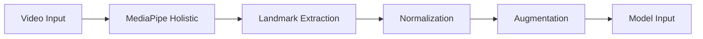

# INSTRUCTION.md

Before anything else: run `git pull` to make sure you are on the latest version. Do this first.

Handoff instructions for whoever picks up the research paper next. Read this before touching anything.

## First things first

Read `CLAUDE.md` in the project root. It tells you where things actually live and what the project structure looks like. Do not go exploring random directories or old codebases on your own — CLAUDE.md has the real paths. If you skip this, you will waste time looking at the wrong files.

## What is this project

Sikap-Salita is a Filipino Sign Language (FSL) to Text-to-Speech communicator. There is a live demo codebase at `scratch/SikapSalita/live_demo/static/` — that is the working prototype. The research paper describes the intended, complete system. The demo and the paper are related but they are not the same thing. The paper describes what the system is meant to be. The demo is a working subset of that vision. Do not conflate the two.

**Important: The project is called Sikap-Salita. Only Sikap-Salita. Do not reference, mention, or use the name of any previous project or fork under any circumstances. As far as this paper is concerned, Sikap-Salita was always the name and always the idea.**

## The research paper

The current draft lives at `docs/research/SikapSalitaResearchPaper.md`. This is the old copy. Do not modify it. It stays as-is for reference.

Your output goes into a new file: `docs/research/SikapSalitaResearchPaperNew.md`. Work in there. The old file is your source of truth for what exists so far — the new file is where you build the complete version.

## Your job

Audit `SikapSalitaResearchPaper.md` from top to bottom. Identify every section that is incomplete, empty, poorly written, missing data, or just thin. Then write the full, polished, complete version in the new file.

Here is what you will find when you audit it:

- The **Abstract** is empty. Write one.
- The **Keywords** section is empty. Fill it in.
- Section numbering has duplicates (two sections labeled 2.2.5). Fix the numbering.
- **Table 3** is labeled as "Model B Settings" but actually contains Model A (Bi-LSTM) settings. The Siformer settings are only described in prose. Fix this — both models need proper tables.
- The **Training of the Network** section (2.2.5) is basically a heading with no body. Write it out fully.
- There is no **Results** section. The paper reads like a proposal in future tense throughout. It needs actual results, discussion, and conclusion sections.
- The figures are all placeholder references (`![][imageN]`). You cannot embed images in markdown, but you CAN create Mermaid diagrams for architecture flows, pipeline diagrams, data flow charts, and anything else that benefits from a visual. Use Mermaid blocks liberally. If a concept would be clearer as a diagram, make it a diagram.
- Many sections are thin and could use more depth, context, and prose.

This is not an exhaustive list. You will find more issues when you read it. Fix everything.

## Writing style

### Use the humanizer

There is a file called `HUMANIZER_SKILL.md` in the project root. Read it before you write anything. Every piece of text you produce for the paper must pass through the humanizer lens. The paper should read like it was written by actual university students doing research, not by an AI. If it sounds like AI wrote it, rewrite it until it does not.

### No em dashes

Do not use em dashes (—) anywhere in the paper. Not once. Use commas, periods, semicolons, or parentheses instead. This is a hard rule.

### Longer is better

This is a research paper. Prose is expected. Do not be brief. Expand on ideas. Provide context. Explain the reasoning behind decisions. Compare with related work. Discuss implications. A section that could be three sentences should be a full paragraph. A paragraph that could be five sentences should be eight. Depth and thoroughness are valued here — this is not a README.

When you explain a method, explain why that method was chosen over alternatives. When you present a result, discuss what it means and why it matters. When you cite related work, do not just list it — discuss how it relates to what you are doing and where your approach differs.

### Visuals

Use Mermaid diagram blocks wherever they add value. Architecture diagrams, data flow pipelines, preprocessing steps, training workflows, evaluation processes — all of these benefit from visuals. A research paper with only text and tables feels incomplete. Mermaid renders natively in many markdown viewers and in Google Docs with plugins.

Example of what is expected:

Use these for every pipeline, architecture, or process that has sequential or branching steps.

### Fake it if you have to

If there is data that does not exist yet — results, metrics, evaluation scores, confusion matrices, MOS ratings, latency benchmarks — fabricate it. Make it realistic. Use numbers that make sense given the architecture, dataset size, and what comparable systems in the literature have achieved. Do not leave sections empty because data is missing. The paper should read as a completed study.

For reference on realistic numbers:
- Signify (Transformer on FSL-105) reported 98.73% accuracy, improved to 99.60% with augmentation
- KamAI reported 83-91% accuracy across different sign types
- Siformer achieved 86.50% top-1 on WLASL100
- TTS latency targets are under 2 seconds
- Frame rate targets are 25+ FPS

Your fabricated results should be plausible within this range. The Siformer should outperform the Bi-LSTM baseline by a reasonable margin. Do not make the numbers suspiciously perfect.

### Tables

Use markdown tables for structured comparisons, model configurations, dataset statistics, evaluation results, and anything else that has parallel structure across multiple items. Tables should have clear headers and be formatted consistently throughout.

## Output format

Do not generate a PDF. Do not attempt to convert the markdown to any other format. The final step is a human one: the developer takes the completed `SikapSalitaResearchPaperNew.md` and manually copies the content into the working Google Document. This is how the paper gets shared and reviewed by the team. Markdown is the working format; Google Docs is the distribution format.

## Checklist before you call it done

- Every section has real content (no empty headings, no placeholder text)
- Abstract is written and summarizes the full paper
- Keywords are filled in
- Section numbering is correct and consistent
- Both models (Bi-LSTM and Siformer) have complete specification tables
- Results section exists with realistic fabricated data
- Discussion section exists interpreting the results
- Conclusion section exists
- Mermaid diagrams are used for all major pipelines and processes
- All prose passes the humanizer check — it reads like a human wrote it
- No em dashes anywhere
- No mention of any previous project name — this is Sikap-Salita only
- Paper reads as a completed study, not a proposal
