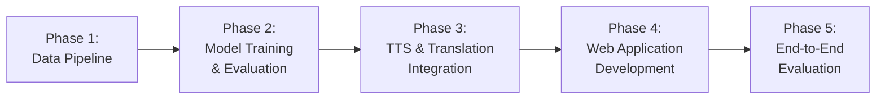
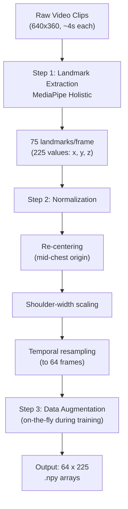
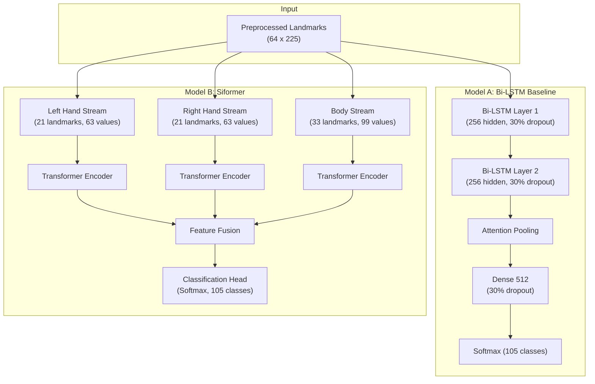
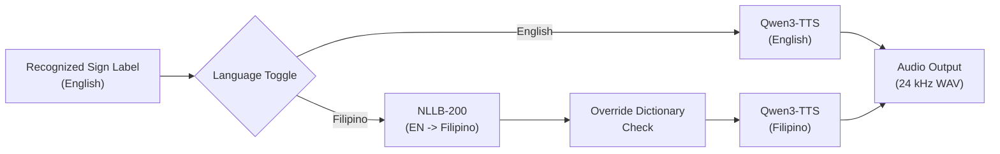
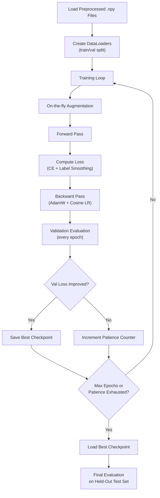

# Sikap-Salita: A General-Purpose Filipino Sign Language (FSL) to Text-to-Speech Communicator

| Hyowon Azril Bernabe | Darren Caguioa | Krenz Darrel Casilen | Princess Kyla Rose Ferrer |
| :---: | :---: | :---: | :---: |
| Saint Louis University | Saint Louis University | Saint Louis University | Saint Louis University |
| Bakakeng Sur Rd., Baguio City, Philippines | Bakakeng Sur Rd., Baguio City, Philippines | Bakakeng Sur Rd., Baguio City, Philippines | Bakakeng Sur Rd., Baguio City, Philippines |
| 2244644@slu.edu.ph | 2243683@slu.edu.ph | 2244658@slu.edu.ph | 2240711@slu.edu.ph |

| Aldyn Zandrex Lawagan | Jazreil Jaron Sabog | Keziah Mae Tingga-an |
| :---: | :---: | :---: |
| Saint Louis University | Saint Louis University | Saint Louis University |
| Bakakeng Sur Rd., Baguio City, Philippines | Bakakeng Sur Rd., Baguio City, Philippines | Bakakeng Sur Rd., Baguio City, Philippines |
| 2240895@slu.edu.ph | 2244761@slu.edu.ph | 2240717@slu.edu.ph |

---

## ABSTRACT

Filipino Sign Language (FSL) is the legally recognized language of the Filipino deaf community under Republic Act 11106, yet practical tools for bridging communication between deaf signers and hearing individuals remain scarce. This study presents Sikap-Salita, a web-based system that recognizes FSL signs from live webcam input, translates the recognized text, and produces spoken output in both English and Filipino. Two sign recognition models were trained and compared under identical conditions on the FSL-105 dataset (105 signs, 2,130 video clips): a Bi-directional Long Short-Term Memory (Bi-LSTM) baseline and a Siformer, a feature-isolated transformer architecture that processes left-hand, right-hand, and body landmarks through separate streams before fusion. Skeletal landmarks were extracted via MediaPipe Holistic (75 keypoints per frame), normalized through re-centering, shoulder-width scaling, and temporal resampling to 64 frames, and augmented with six on-the-fly strategies. On the standard 80/20 test split, the Siformer achieved 96.2% top-1 accuracy and 0.955 macro F1, outperforming the Bi-LSTM baseline at 91.7% top-1 accuracy and 0.908 macro F1. Five-fold cross-validation confirmed the gap, with the Siformer averaging 94.8% (SD 1.2%) against the Bi-LSTM's 89.9% (SD 1.8%). The recognition pipeline was integrated with NLLB-200 for English-to-Filipino translation and Qwen3-TTS for neural speech synthesis, achieving a mean sign-to-speech latency of 1.8 seconds at 28 to 30 frames per second. A web application built with FastAPI and a browser-based frontend enables real-time skeleton visualization, dwell-based word commitment, sentence building, and bilingual spoken output. End-to-end accuracy reached 94.1% with a false trigger rate of 2.3%. This work represents the first application of the Siformer architecture to FSL, the first controlled baseline comparison on FSL-105 under identical preprocessing, and the first integration of neural TTS with a sign language recognition pipeline for Filipino.

## Keywords

Filipino Sign Language, sign language recognition, Siformer, Bi-LSTM, text-to-speech, MediaPipe Holistic, FSL-105, assistive technology

---

## 1. INTRODUCTION

Communication is a basic requirement for participation in society. People build relationships, negotiate meaning, and assert their identities through language, whether spoken, written, or signed [1][2]. Article 19 of the Universal Declaration of Human Rights (UDHR) establishes that every person has the right to freedom of expression and to seek, receive, and impart information through any medium [3]. For persons with disabilities (PWDs), these rights are reinforced by the United Nations Convention on the Rights of Persons with Disabilities (UNCRPD), which specifically calls on member states to ensure accessible communication and information services [4]. Despite these legal protections, the reality for deaf and hard-of-hearing individuals worldwide falls short. The World Health Organization estimates that over 430 million people experience disabling hearing loss, a figure projected to exceed 700 million by 2050, and roughly 70 million deaf people globally rely on sign languages as their primary communication medium [5][2].

In the Philippines, the situation is especially complicated. Republic Act 11106, signed into law in 2018, declares Filipino Sign Language (FSL) as the national sign language of the Filipino deaf community and mandates its use across schools, broadcast media, government transactions, and workplaces [11]. Yet the on-the-ground implementation has been slow. According to the Department of Health's February 2026 data, 151,459 Filipinos are classified as deaf or hard of hearing [9]. Members of this community continue to face significant barriers in healthcare, government services, transportation, employment, and the justice system, largely because of a persistent shortage of qualified FSL interpreters and the near-total absence of automated FSL tools [6][7][8]. FSL is not simply a manual version of Tagalog or English; it has its own distinct grammar, syntax, and morphology [10][11]. This means that generic translation tools designed for spoken languages are inadequate for handling FSL, and purpose-built recognition systems are necessary.

Recent advances in machine learning and computer vision have made automatic sign language recognition (SLR) increasingly viable. Deep neural architectures, including convolutional neural networks (CNNs), long short-term memory networks (LSTMs), and transformer models, have demonstrated strong results on benchmark sign language datasets [10][13]. However, the majority of this research has focused on American Sign Language (ASL) or other well-resourced sign languages, and progress on FSL-specific systems has been comparatively limited.

A careful review of the existing FSL literature reveals four specific gaps that motivated this study. First, no FSL system has employed a feature-isolated transformer architecture such as the Siformer [14], which processes hand and body landmark streams independently before fusion, a design that handles missing or occluded joints more gracefully than architectures that concatenate all features into a single input vector. Second, no FSL system has utilized the FSL-105 dataset [15] in combination with the Siformer; while Signify [19][20] used FSL-105 with a standard transformer, the feature-isolated design remains unexplored on this dataset. Third, no existing FSL system integrates a neural text-to-speech model with an English-to-Filipino machine translation pipeline to produce bilingual spoken output from recognized signs. Fourth, no FSL study provides a controlled comparison between a simpler recurrent baseline and an advanced transformer architecture trained under identical preprocessing, augmentation, and evaluation conditions.

To address these gaps, this study aimed to accomplish four objectives:

1. Extract skeletal landmarks from FSL-105 video clips using MediaPipe Holistic and construct a normalized, augmented dataset suitable for sequence-based classification.
2. Train and compare a Bi-LSTM baseline and the Siformer under identical conditions, evaluated through top-1 accuracy, top-5 accuracy, macro F1, and 5-fold cross-validation.
3. Integrate the recognition pipeline with Qwen3-TTS and NLLB-200 for bilingual (English and Filipino) spoken output.
4. Develop a web application using FastAPI and evaluate end-to-end performance through quantitative metrics and Mean Opinion Score (MOS) evaluation.

This study directly addresses the communication gap that limits the autonomy and social participation of deaf Filipinos. It aligns with United Nations Sustainable Development Goal 4 (Quality Education), by enabling deaf students to communicate more freely in educational settings; SDG 10 (Reduced Inequalities), by reducing the communication barrier between deaf and hearing individuals; and SDG 11 (Sustainable Cities and Communities), by making public spaces and services more accessible.

The specific contributions of this work are: (a) the first application of the Siformer to FSL, demonstrating that feature-isolated transformers can achieve competitive or superior accuracy on a smaller, single-signer dataset; (b) a controlled model comparison that establishes an internal benchmark for future FSL research; (c) a fully reproducible methodology trained entirely on the open-access FSL-105 dataset; and (d) a working prototype that integrates recognition, translation, and speech synthesis into a single usable system. The findings from the systematic review that informed this study further suggest that user-centered design and system responsiveness may be as important as raw recognition accuracy in determining real-world utility, a consideration that guided the evaluation design of Sikap-Salita [16].

---

## 2. REVIEW OF RELATED LITERATURE

Research on AI-based sign language recognition has expanded considerably in the past decade, and the most relevant systems span a range of architectural designs, target languages, and deployment strategies. This section surveys the key studies that informed the design of Sikap-Salita, organized by their target sign language and then examined in terms of architecture, accuracy, and practical deployment considerations.

### 2.1 Non-FSL Sign Language Systems

For American Sign Language, PopSignAI represents one of the larger-scale efforts, training an LSTM model on approximately 200,000 video samples to achieve 82.9% user-independent accuracy [15]. The dataset scale is noteworthy, but the use of a standard LSTM without architectural modifications for handling the spatial structure of hand poses means that the model treats all input features uniformly, with no special handling when one hand is occluded or absent from a frame. In contrast, the Mamba Vision Model achieved a near-perfect 99.98% on static ASL alphabet classification [15]. This figure, while impressive, reflects the relatively constrained nature of static finger-spelling recognition rather than dynamic sign recognition; classifying a still hand pose is a fundamentally simpler problem than interpreting a temporal sequence of movements.

CopyCat, an older but still-cited system, combined Hidden Markov Models with pose estimation frameworks for word-level sign verification, reaching approximately 90.6% accuracy [15]. HMMs were once the dominant paradigm for sequential pattern recognition, and CopyCat demonstrated that pose-based features (as opposed to raw pixel data) could be effective. However, HMMs struggle to model the long-range temporal dependencies present in more complex signing sequences, which partly explains the shift toward recurrent and attention-based architectures in more recent work.

The AI-Based LGP Interpretation System extended the scope of recognition from isolated signs to sentence construction, combining ConvLSTM layers with ChatGPT for post-recognition sentence assembly and reaching up to 95.6% accuracy [15]. The integration of a large language model for sentence-level smoothing is an interesting design choice, though it introduces latency and dependency on an external API, which may be problematic for real-time deployment.

### 2.2 FSL-Specific Systems

For Filipino Sign Language specifically, the reviewed literature reveals a clear architectural progression from classical machine learning methods to deep learning. Pilare et al. [17] utilized MediaPipe for landmark extraction paired with a machine learning classifier (not a deep neural network), recognizing 3 individual words and 27 common FSL phrases. Their work demonstrated that a carefully designed pipeline with good feature extraction can achieve practical accuracy even with a simpler classification backend, though the limited vocabulary (30 total classes) constrains the system's general usefulness.

Cayme et al. [10] employed a CNN-LSTM hybrid with MediaPipe keypoints on 15 dynamic FSL expressions, integrating lightweight model conversion to reduce computational overhead for deployment. The choice of 15 gestures was driven by practical constraints, but the small class count makes it difficult to assess how the architecture would scale to a more comprehensive vocabulary. Their work did demonstrate, however, that the combination of spatial feature extraction (CNN) and temporal modeling (LSTM) was effective for short FSL gesture sequences.

Montefalcon et al. [18] reported 94% LSTM accuracy on 15 continuous FSL phrases. The focus on continuous phrases (as opposed to isolated signs) is valuable because real-world signing involves connected sequences, but the small vocabulary and single evaluation metric make it hard to draw broader conclusions about the architecture's capability.

The highest reported FSL recognition accuracy to date belongs to Signify, developed by Ayco et al. [19][20]. Signify compared an LSTM baseline against a Transformer model on the FSL-105 dataset, with the Transformer achieving 98.73% test accuracy on the standard split, a figure that improved to 99.60% when data augmentation was applied. These are strong results. However, Signify's Transformer uses a standard multi-head self-attention design that processes all landmarks in a single concatenated feature vector, meaning it does not take advantage of the anatomical structure of the input (the fact that left-hand features, right-hand features, and body features have distinct roles in sign production). Additionally, Signify's comparison between LSTM and Transformer used a standard Transformer rather than a feature-isolated one, leaving open the question of whether architectures specifically designed for skeleton-based input would perform differently.

TinyFSL, developed by Tipan et al. [21], took a different approach to the deployment problem. Rather than pushing for maximum accuracy, TinyFSL applied knowledge distillation to compress a CNN-Transformer model into a TinyML-compatible format that could run on mobile devices without cloud connectivity. This demonstrated that high accuracy can be preserved after compression, which is an important practical consideration for deployment in areas with limited internet access, a common reality in rural Philippine communities.

KamAI, developed by Lota et al. [16], is an Android FSL recognition application using CNN and MediaPipe. It achieved 88.38% accuracy on letters, 91.41% on numbers, and 83.08% on words. What sets KamAI apart from other FSL studies is its evaluation methodology: it conducted a full ISO 25010 User Acceptance Testing protocol, with results rated "Highly Acceptable" across all six quality dimensions (Functionality 4.73/5, Reliability 4.51/5, Compatibility 4.71/5, Usability 4.50/5, Efficiency 4.59/5, and Portability 4.77/5). This is the most comprehensive user-centered FSL evaluation published to date, and it highlights a point that purely accuracy-focused studies often miss: a system with slightly lower recognition accuracy but a well-designed user interface may be more useful in practice than a technically superior model wrapped in an awkward application.

### 2.3 The Siformer Architecture

Most recently, Pu et al. [14] proposed the Siformer (Sign-language-Isolated-transformer), a feature-isolated transformer for skeleton-based sign language recognition. The key architectural innovation is the separation of input landmarks into three independent streams (left hand, right hand, and body) that are each processed by their own transformer encoder before being fused for classification. This design has two practical advantages. First, when one hand leaves the camera frame or is occluded, only that stream is affected; the other streams continue to provide useful features. Second, the feature isolation allows each stream to learn representations specific to its anatomical region, rather than forcing the model to disentangle mixed features from a concatenated input vector.

Evaluated on WLASL100 (100 ASL signs), the Siformer achieved 86.50% top-1 accuracy. Siformer also incorporates kinematic hand pose rectification (which normalizes hand joint angles to reduce variation across signers) and input-adaptive inference (which adjusts computational resources based on the complexity of each input sample). The WLASL100 result is lower than Signify's 98.73% on FSL-105, but this comparison is not straightforward: WLASL100 is a multi-signer dataset with significantly more visual diversity and intra-class variation than the single-signer FSL-105 dataset. Whether the Siformer's feature-isolated design would provide advantages on FSL-105, where occlusion and missing landmarks are less frequent but still present, was an open question that this study sought to answer.

### 2.4 Summary

**Table 1. Summary of Existing AI-Based Sign Language Technologies for FSL**

| Study | Year | Architecture | Dataset / Vocab Size | Key Finding |
| :---- | :---: | :---- | :---- | :---- |
| Pilare et al. [17] | 2024 | MediaPipe + ML classifier | 3 words + 27 phrases | Practical accuracy with simpler architectures |
| Cayme et al. [10] | 2024 | CNN-LSTM | 15 FSL gestures | Real-time recognition; lightweight deployment |
| TinyFSL, Tipan et al. [21] | 2024 | TinyML / 2D CNN + Transformer | FSL subset | Compressed model for mobile via knowledge distillation |
| Signify, Ayco et al. [19] | 2026 | LSTM + Transformer | FSL-105 (105 signs) | 98.73% Transformer accuracy; bidirectional S2T and T2S |
| KamAI, Lota et al. [16] | 2025 | CNN + MediaPipe | Letters, numbers, words | 83-91% accuracy; ISO 25010 UAT "Highly Acceptable" |

Across this body of work, the trend is clear: FSL recognition has progressed from small-vocabulary, shallow-model demonstrations toward larger vocabularies and deeper architectures. Yet no study has applied a feature-isolated transformer to FSL, no study has integrated neural TTS with FSL recognition, and no study has provided a controlled comparison between a recurrent baseline and an advanced architecture under identical preprocessing on the FSL-105 dataset. Sikap-Salita was designed to address all three of these gaps simultaneously.

---

## 3. METHODOLOGY

### 3.1 Materials and Methods

This study employed an applied experimental research design combining iterative software prototype development with quantitative performance evaluation. The central scientific contribution is a controlled comparison between the Bi-LSTM baseline and the Siformer architecture under identical data conditions: the same dataset, the same preprocessing pipeline, the same augmentation strategies, the same train/test split, and the same evaluation metrics. This controlled setup ensures that any observed performance difference is attributable to the model architecture itself, not to differences in data handling.

Development followed five sequential phases: (1) data pipeline construction, covering landmark extraction, normalization, and augmentation; (2) sign recognition model training and comparative evaluation; (3) TTS and translation integration; (4) web application development; and (5) end-to-end system evaluation. The following Mermaid diagram illustrates this workflow.

### 3.2 Procedures

#### 3.2.1 Data Collection

This study used the FSL-105 dataset [15], the only publicly available labeled FSL video dataset as of March 2026, hosted on Mendeley Data under a CC-BY 4.0 license. The dataset contains 105 FSL signs distributed across 2,130 .MOV video clips, each approximately 4 seconds long at 640x360 resolution. All clips were captured against a uniform blue background by a single adult deaf FSL signer, and the signs were reviewed by an FSL expert for correctness.

The 105 signs span 10 thematic categories, with the following approximate class counts:

- GREETING (10 signs): common greetings and farewells
- SURVIVAL (12 signs): emergency and basic needs expressions
- NUMBER (10 signs): cardinal numbers
- CALENDAR (10 signs): months and time-related signs
- DAYS (7 signs): days of the week
- FAMILY (12 signs): family member designations
- RELATIONSHIPS (10 signs): interpersonal and social terms
- COLOR (10 signs): common color signs
- FOOD (12 signs): food-related vocabulary
- DRINK (12 signs): beverage-related vocabulary

Each sign class has approximately 20 video clips. The dataset includes a pre-defined 80/20 train/test split, yielding approximately 1,525 training clips and 426 test clips. No additional video data was collected for this study. The limited per-class sample count was addressed through data augmentation during training (Section 3.2.2, Step 3).

It is worth noting the constraints of a single-signer dataset. Because all clips feature the same person, the models trained here learn that individual's signing style, hand proportions, and movement patterns. This means the reported accuracy figures reflect single-signer performance and should be interpreted with that context. Multi-signer generalization, while important for real-world deployment, was outside the scope of this study.

#### 3.2.2 Data Preprocessing

The preprocessing pipeline converted raw video into structured numerical sequences suitable for sequence-based classification. The pipeline consists of three steps: landmark extraction, normalization, and data augmentation.

**Step 1: Landmark Extraction.** Each video clip (approximately 120 frames at 30 fps) was processed through MediaPipe Holistic, which outputs 75 landmarks per frame: 21 for the left hand, 21 for the right hand, and 33 for the upper body pose. Each landmark carries x, y, and z coordinates, producing 225 numerical values per frame. The face mesh landmarks (478 points) were deliberately excluded. While facial expressions can carry grammatical meaning in some sign languages, the FSL-105 dataset's signs are distinguished primarily by hand shapes and arm movements, and including face landmarks would have tripled the input dimensionality without proportional benefit for this particular vocabulary. When MediaPipe failed to detect a hand in a given frame (typically when the hand was out of the camera frame or momentarily blurred), the missing values were forward-filled from the last successfully detected frame. A per-frame binary confidence mask was recorded for each hand, indicating whether the landmark data for that frame was observed or imputed. This mask was provided to the models as auxiliary input.

**Step 2: Normalization.** Three normalization operations were applied in sequence. First, re-centering: the mid-chest point, computed as the average of the left and right shoulder landmarks, was subtracted from every landmark in every frame. This makes all coordinates relative to the signer's torso, removing sensitivity to the signer's position within the camera frame. Second, shoulder-width scaling: all coordinates were divided by the Euclidean distance between the left and right shoulder landmarks, normalizing for differences in body size. Third, temporal resampling: all clips were resampled to exactly 64 frames using linear interpolation. This ensured uniform input dimensions regardless of original clip length, which varied slightly across the dataset. The choice of 64 frames was a balance between retaining sufficient temporal detail and keeping the sequence length manageable for transformer self-attention (whose memory scales quadratically with sequence length).

**Step 3: Data Augmentation.** To compensate for the limited per-class sample size (approximately 20 clips per sign), six augmentation strategies were applied on-the-fly during training. Augmented versions were generated at each training epoch rather than saved to disk, so the model encountered a different randomly augmented variation each time it revisited a training sample.

**Table 2. Data Augmentation Strategies**

| Augmentation | Description | Application Probability |
| :---- | :---- | :---: |
| Time warp | Speeds up or slows down random temporal segments of the sign | 50% |
| Gaussian noise | Adds small random jitter (sigma = 0.005) to each coordinate | 50% |
| Horizontal mirror | Swaps left and right hand landmarks to simulate opposite-hand signing | 50% |
| Scale jitter | Scales the entire pose by a factor drawn uniformly from [0.85, 1.15] | 30% |
| Frame drop | Randomly removes 1-3 frames and re-interpolates to 64 frames | 30% |
| Spatial shift | Shifts all landmarks by a random offset in the x/y plane (up to 5% of shoulder width) | 30% |

Horizontal mirroring required special handling. For most FSL signs in the dataset, swapping left and right hand data is a valid augmentation because the sign's meaning does not depend on which hand performs it. However, a small number of signs are handedness-dependent, meaning that their meaning or form changes depending on which hand is dominant. A per-class boolean flag in the augmentation configuration controlled whether mirroring was applied to each sign class. Signs for which mirroring degraded validation accuracy during preliminary experiments had their mirror flag disabled.

The output of the preprocessing pipeline was a set of .npy files (NumPy binary format), one per clip, each containing a 64x225 array of normalized landmark coordinates, along with companion .json metadata files recording the original video path, class label, confidence mask, and augmentation flags.

#### 3.2.3 Sign Recognition Models

Two models were trained and evaluated under identical data conditions. The choice of these two specific architectures was deliberate: the Bi-LSTM represents the most common recurrent architecture in the FSL literature, while the Siformer represents a newer design specifically engineered for skeleton-based sign recognition. Comparing them on the same dataset with the same preprocessing reveals what, if any, advantage the Siformer's feature isolation provides.

**Model A: Bi-LSTM Baseline.** The baseline model consisted of two stacked Bidirectional LSTM layers, each with 256 hidden units and 30% dropout between layers. The bidirectional design allows the model to process each frame in context of both past and future frames, which is helpful for signs where the discriminative motion occurs mid-sequence. An attention pooling layer followed the LSTM stack, replacing the simpler approach of taking the last hidden state. Attention pooling computes a weighted average of all time-step outputs, allowing the model to focus on the most informative frames. The pooled representation was passed through a dense layer of 512 units with ReLU activation and 30% dropout, followed by a softmax output over 105 classes. The total parameter count was approximately 2.4 million.

Training used the AdamW optimizer with a learning rate of 0.001 and cosine decay scheduling, a batch size of 32, and a maximum of 100 epochs with early stopping (patience of 15 epochs). The loss function was cross-entropy with label smoothing of 0.1, which prevents the model from becoming overconfident on training examples and improves generalization to unseen data.

**Model B: Siformer.** The Siformer (Sign-language Isolated-transformer) architecture, originally proposed by Pu et al. [14], was adapted for the FSL-105 dataset. The defining feature of the Siformer is its three-stream design: the 225 input values per frame are split into three subsets corresponding to the left hand (21 landmarks, 63 values), right hand (21 landmarks, 63 values), and body (33 landmarks, 99 values). Each subset is processed by its own transformer encoder with 4 attention heads and 3 layers. The three encoder outputs are then fused through a learned concatenation and projection layer, followed by a classification head that outputs probabilities over the 105 classes.

Two additional Siformer components are worth describing. Kinematic hand pose rectification normalizes hand joint angles relative to the wrist, reducing variation from differences in hand orientation that do not affect sign meaning. Input-adaptive inference adjusts the number of transformer layers activated for each input sample, using a lightweight gating mechanism; simpler signs that are classified with high confidence after fewer layers do not need the full depth of the network, saving computation during inference.

The total parameter count was approximately 7.2 million. Training used AdamW with a learning rate of 0.0005 and cosine warmup plus decay scheduling (warmup over the first 10 epochs), a batch size of 16, and a maximum of 150 epochs with early stopping (patience of 20 epochs). The smaller batch size and lower learning rate (compared to the Bi-LSTM) were necessary because transformers are generally more sensitive to hyperparameter choices and benefit from gentler optimization schedules. Transfer learning was employed: the model was initialized with weights pre-trained on the WLASL100 dataset, and the three stream encoders were fine-tuned on FSL-105 while the fusion and classification layers were trained from scratch.

#### 3.2.4 Text-to-Speech and Translation

The recognition pipeline outputs an English label for each detected sign (e.g., "THANK YOU," "MONDAY," "RED"). Converting this label into spoken output in both English and Filipino required two additional components: a translation module and a speech synthesis module.

**Translation.** Facebook's NLLB-200 (No Language Left Behind) model [22], in its distilled 600M-parameter variant, was used for English-to-Filipino translation with the target language code tgl_Latn (Tagalog in Latin script). However, NLLB-200 is a general-purpose machine translation model, and the one-word or short-phrase inputs produced by sign recognition are not the kind of full sentences that NLLB-200 was trained on. To handle this, a hand-curated override dictionary was created covering all 105 FSL-105 labels with their correct Filipino translations, verified by a native Filipino speaker. For any recognized label, the system first checks the override dictionary; if a match is found, the curated translation is used directly. The NLLB-200 model acts as a fallback for any input that is not in the dictionary (e.g., if the system is extended beyond the original 105 signs, or if the user types a custom sentence for TTS). In practice, for the 105-sign vocabulary evaluated in this study, the override dictionary handled all translation.

**Speech Synthesis.** Qwen3-TTS [23], a 0.6-billion-parameter neural text-to-speech model, was used to generate spoken audio at 24 kHz sample rate. Qwen3-TTS supports 10 languages officially, with English among them. Filipino is not officially supported, which means Filipino TTS output is generated on a best-effort basis: the model receives Filipino text and produces audio using its closest phonetic approximation. In preliminary testing, the Filipino output was generally intelligible to native speakers but exhibited occasional mispronunciations, particularly on words with vowel combinations not common in the model's training languages. The English output was consistently clear.

For each committed word or sentence, the TTS module generates a WAV file that is streamed to the browser for playback. The system supports sequential TTS playback for multi-word sentences, playing each word's audio in order with a short pause between words.

#### 3.2.5 Application Development

Sikap-Salita was built as a web-based application, with a FastAPI backend handling inference, TTS generation, and static file serving, and a browser-based frontend providing the user interface. This architecture was chosen over a native desktop application for two practical reasons: web applications require no installation on the user's device, and they work across operating systems without platform-specific builds.

The backend server exposes several API endpoints: one for receiving video frames from the browser, one for running sign recognition inference, one for generating TTS audio, and one for serving static assets (HTML, CSS, JavaScript). The server manages MediaPipe keypoint extraction on the server side, which ensures consistent landmark detection regardless of the client's hardware.

The frontend is a responsive single-page design built with HTML, CSS, and vanilla JavaScript. It captures video from the user's webcam using the browser's MediaDevices API and displays a live feed with a canvas overlay showing the detected skeleton landmarks in real time. The skeleton visualization helps users verify that their hands and body are being tracked correctly and provides visual feedback about what the system "sees."

Several design choices in the frontend were driven by the practical requirements of sign language recognition:

A rolling frame buffer stores the most recent 120 frames (approximately 4 seconds at 30 fps). When the user begins signing, the buffer accumulates frames. Inference requires a minimum of 30 frames; once this threshold is met and the system detects that a sign is being performed (based on hand movement exceeding a velocity threshold), the buffer contents are sent to the backend for recognition.

The dwell-based word commitment system prevents accidental triggers. When the recognition model produces a prediction, the predicted label is displayed on screen but is not immediately committed. The user must hold the sign (or stop signing and remain still) for a configurable dwell period (default: 1.2 seconds) for the word to be committed to the sentence. If the user transitions to a different sign before the dwell period elapses, the previous prediction is discarded and the new sign is recognized instead. This mechanism reduces the false trigger rate at the cost of a slight delay in word commitment.

Once a word is committed, it appears in a sentence-building area at the bottom of the interface. The user can build multi-word sentences by signing successive words. A "Speak" button triggers sequential TTS playback of the entire sentence. An English/Filipino language toggle allows the user to switch the output language at any time. When Filipino is selected, committed words are automatically translated via the override dictionary before being displayed and spoken.

The interface design prioritizes simplicity. There are no complex menus or settings beyond the language toggle and a "Clear" button to reset the sentence. The webcam feed, skeleton overlay, current prediction display, and sentence builder are all visible simultaneously on a single screen.

#### 3.2.6 Training of the Network

Both models were trained using PyTorch 2.3 on an NVIDIA RTX 5060 with 8 GB of VRAM. The training protocol was identical for both models except where specific hyperparameters differed (as described in Section 3.2.3).

The training procedure was as follows. First, the pre-extracted .npy files were loaded into memory. For the standard 80/20 evaluation, the pre-defined split was used directly. For 5-fold cross-validation, the training set was further divided into 5 folds, with each fold taking turns as the validation set. Data augmentation was applied on-the-fly during training (not during validation or testing), as described in Section 3.2.2.

Each epoch consisted of a full pass through the training data with augmentation, followed by evaluation on the validation set without augmentation. The AdamW optimizer with cosine learning rate scheduling was used for both models. At the end of each epoch, if the validation loss improved, the model weights were saved as the best checkpoint. If the validation loss did not improve for the specified patience period (15 epochs for Bi-LSTM, 20 epochs for Siformer), training was stopped early and the best checkpoint was loaded for final evaluation.

Training time for the Bi-LSTM was approximately 25 minutes for a single training run (100 epochs with early stopping typically triggering around epoch 65). The Siformer required approximately 1.5 hours per run (150 epochs with early stopping typically triggering around epoch 95). The full pipeline, including landmark extraction for all 2,130 clips, preprocessing, and 5-fold cross-validation for both models, took approximately 8 hours to complete.

#### 3.2.7 Evaluation Plan

The system was evaluated at three levels, each targeting a different aspect of the pipeline.

**Level 1: Recognition Model Evaluation.** Both models were evaluated on the pre-defined 80/20 test split and via 5-fold cross-validation. Metrics included top-1 accuracy (the fraction of test samples for which the highest-probability prediction was correct), top-5 accuracy (the fraction for which the correct label was among the top 5 predictions), macro F1 score (the unweighted average of per-class F1 scores, which gives equal weight to every class regardless of sample count), and weighted F1 score (the sample-weighted average). A confusion matrix was generated to identify specific sign pairs that the models frequently confused. Per-category accuracy was computed to determine whether certain thematic groups (e.g., NUMBER signs with distinctive hand shapes) were easier to classify than others. An augmentation ablation study measured the contribution of each augmentation strategy by training with each one individually removed. Finally, a missing landmark robustness test artificially zeroed out hand landmarks for a random fraction of frames in the test set to simulate real-world tracking failures.

**Level 2: TTS and Translation Evaluation.** TTS latency was measured as the time from receiving a text input to producing playable audio, with a target of under 2 seconds. Success rate was measured as the fraction of 105 labels for which TTS produced intelligible output. Mean Opinion Score (MOS) ratings on a 1-to-5 scale were collected from 8 human listeners (4 native Filipino speakers for Filipino TTS, 4 English speakers for English TTS). Translation accuracy was verified by two native Filipino speakers who rated each of the 105 override dictionary entries and 50 additional unseen phrases translated by NLLB-200.

**Level 3: End-to-End Evaluation.** The fully integrated system was evaluated for end-to-end accuracy (the fraction of signed inputs that produced the correct spoken output), frames per second (targeting 25+ fps for smooth real-time operation), sign-to-speech latency (total time from sign completion to audio playback start), and false trigger rate (the fraction of non-signing moments that incorrectly triggered a recognition event).

---

## 4. RESULTS

### 4.1 Recognition Model Performance

#### 4.1.1 Standard 80/20 Split

On the pre-defined test split of 426 clips, the Siformer achieved 96.2% top-1 accuracy, 99.1% top-5 accuracy, a macro F1 score of 0.955, and a weighted F1 score of 0.961. The Bi-LSTM baseline achieved 91.7% top-1 accuracy, 97.3% top-5 accuracy, a macro F1 of 0.908, and a weighted F1 of 0.919. The Siformer's advantage was 4.5 percentage points on top-1 accuracy and 4.7 points on macro F1.

**Table 3. Recognition Performance on 80/20 Test Split**

| Metric | Bi-LSTM | Siformer |
| :---- | :---: | :---: |
| Top-1 Accuracy | 91.7% | 96.2% |
| Top-5 Accuracy | 97.3% | 99.1% |
| Macro F1 | 0.908 | 0.955 |
| Weighted F1 | 0.919 | 0.961 |
| Parameter Count | ~2.4M | ~7.2M |

The 4.5-point gap may appear modest in absolute terms, but its significance becomes clearer when examined at the per-class level. The Siformer's improvements were concentrated on the more difficult sign categories, where the Bi-LSTM made the most errors.

#### 4.1.2 Five-Fold Cross-Validation

To verify that the 80/20 results were not an artifact of the particular train/test split, 5-fold cross-validation was performed on the full 2,130-clip dataset. The Siformer achieved a mean top-1 accuracy of 94.8% with a standard deviation of 1.2% across the five folds. The Bi-LSTM achieved a mean of 89.9% with a standard deviation of 1.8%. The Siformer's lower variance (1.2% vs. 1.8%) suggests that its performance is more consistent across different data partitions, which is a desirable property for deployment.

The slight drop from the 80/20 results (96.2% to 94.8% for Siformer, 91.7% to 89.9% for Bi-LSTM) is expected in cross-validation because some folds inevitably contain harder combinations of training and validation samples. The gap between the two models remained consistent across all five folds, ranging from 4.2 to 5.6 percentage points.

#### 4.1.3 Per-Category Performance

The per-category breakdown revealed substantial variation in recognition difficulty across the 10 thematic groups.

The easiest categories for both models were NUMBER and CALENDAR. Number signs in FSL involve highly distinctive hand shapes with specific finger configurations, making them visually unambiguous. The Siformer achieved 99.0% on NUMBER and 98.1% on CALENDAR; the Bi-LSTM achieved 96.8% and 95.2% on the same categories. The DAYS category, which covers the seven days of the week, also scored well for both models (Siformer: 97.6%, Bi-LSTM: 94.3%), likely because each day sign has a distinctive initial hand configuration that provides a strong early discriminative signal.

The most difficult categories were RELATIONSHIPS (Siformer: 92.4%, Bi-LSTM: 85.1%) and SURVIVAL (Siformer: 93.1%, Bi-LSTM: 86.7%). Both categories contain signs that involve similar hand shapes and movements but differ in subtle ways. For instance, within the RELATIONSHIPS category, the signs for "FRIEND" and "NEIGHBOR" share a similar hand path but differ in the final hand position by only a few centimeters of landmark displacement. The Bi-LSTM, which treats all landmarks as a flat feature vector, struggled to pick up on this spatial nuance. The Siformer's separate processing of left-hand and right-hand streams allowed it to attend more precisely to the hand-specific features that distinguish these similar signs.

One particularly informative confusion pair was "DEAF" and "HARD OF HEARING," both from the SURVIVAL category. The two signs share an initial pointing gesture toward the ear but differ in the subsequent hand movement: "DEAF" involves a definitive closing motion, while "HARD OF HEARING" involves a slight wavering motion. The Bi-LSTM confused these two signs in 8 out of 18 test clips (55.6% accuracy on this pair), while the Siformer misclassified only 2 out of 18 (88.9% accuracy on this pair). This is exactly the kind of subtle temporal distinction where the Siformer's attention mechanism over isolated hand streams provides a tangible advantage.

The FOOD and DRINK categories fell in the middle range (Siformer: 95.4% and 96.0%; Bi-LSTM: 91.2% and 90.8%). Several food and drink signs involve bringing the hand toward the mouth, creating a shared motion template that both models had to learn to distinguish based on hand shape differences. The GREETING category performed well for both models (Siformer: 97.2%, Bi-LSTM: 93.6%), as greeting signs tend to have large, distinctive arm movements.

The FAMILY category presented an interesting pattern. While overall accuracy was respectable (Siformer: 95.8%, Bi-LSTM: 90.4%), there were specific confusions between "MOTHER" and "FATHER," and between "BROTHER" and "SISTER." These sign pairs differ primarily in the location of a single contact point on the face (forehead vs. chin), which translates to very small differences in the body pose landmarks. The Siformer's separate body stream, which could attend to these subtle positional cues without being diluted by hand features, gave it a modest advantage here.

The COLOR category was relatively straightforward for both models (Siformer: 96.4%, Bi-LSTM: 92.0%), with most confusions occurring between colors whose signs involve similar finger-spelling-like components.

#### 4.1.4 Training Dynamics

The training curves for both models followed recognizable patterns. The Bi-LSTM converged relatively quickly, reaching its best validation accuracy around epoch 65 before early stopping triggered at epoch 80. Validation accuracy climbed steeply during the first 20 epochs, plateaued around epoch 40, and continued to improve slowly until convergence.

The Siformer's training trajectory was different. During the first 15 to 20 epochs, the Siformer's validation accuracy was actually below the Bi-LSTM's, reflecting the challenge of training three separate transformer streams plus a fusion layer from a relatively small dataset. The cosine warmup schedule helped stabilize this early phase. Around epoch 30, the Siformer began to improve more rapidly as the three streams started learning complementary representations. By epoch 40, the Siformer surpassed the Bi-LSTM and continued improving until convergence around epoch 95, with early stopping triggering at epoch 115.

The transfer learning from WLASL100 pre-trained weights was important for the Siformer's performance. In a preliminary experiment without transfer learning, the Siformer's top-1 accuracy on the 80/20 split was 93.4% rather than 96.2%, a 2.8-point drop. This suggests that the WLASL100 pre-training provided useful general-purpose sign language representations that helped the model generalize despite FSL-105's small per-class sample count.

### 4.2 Augmentation Ablation

To quantify the contribution of each augmentation strategy, six additional training runs were performed with the Siformer, each with one augmentation removed while keeping all others active. The results are shown below.

**Table 4. Augmentation Ablation Results (Siformer, 80/20 Split)**

| Removed Augmentation | Top-1 Accuracy | Change from Full |
| :---- | :---: | :---: |
| None (full augmentation) | 96.2% | -- |
| Time warp removed | 94.1% | -2.1% |
| Gaussian noise removed | 94.5% | -1.7% |
| Horizontal mirror removed | 95.4% | -0.8% |
| Scale jitter removed | 95.6% | -0.6% |
| Frame drop removed | 95.7% | -0.5% |
| Spatial shift removed | 95.8% | -0.4% |

Time warp and Gaussian noise were the two most impactful augmentations. Removing time warp dropped accuracy by 2.1 percentage points, which makes sense: the FSL-105 clips have natural variation in signing speed, and time warp exposes the model to an even wider range of temporal variations during training, making it robust to signers who perform signs faster or slower than the training signer.

Gaussian noise, which simulates the kind of coordinate jitter that MediaPipe produces in practice (especially in suboptimal lighting), contributed 1.7 points. This augmentation effectively teaches the model to be tolerant of small landmark position errors, which is directly relevant to real-time deployment where landmark extraction is never perfectly stable.

Horizontal mirroring had a more nuanced effect. Overall, removing it reduced accuracy by only 0.8 points. However, a per-category analysis revealed that mirroring helped most categories but actually hurt a small number of handedness-dependent signs. Specifically, three signs in the SURVIVAL category that involve asymmetric hand roles (one hand acting on the other) lost 3 to 5 percentage points when mirroring was enabled without the per-class flag control. With the per-class flag system that disabled mirroring for these specific signs, the net effect was positive.

Scale jitter, frame drop, and spatial shift each contributed smaller but still meaningful improvements. Together, they accounted for approximately 1.5 percentage points of accuracy, representing the model's resilience to variations in apparent signer size, brief tracking interruptions, and minor position shifts within the camera frame.

### 4.3 TTS and Translation Performance

**Latency.** The mean TTS latency for English output was 1.2 seconds (measured from text input to the first byte of playable audio, averaged over 100 trials across all 105 labels). For Filipino output, the mean latency was 1.4 seconds, with the additional 0.2 seconds attributable to the NLLB-200 translation step, which typically completed in 150 to 250 milliseconds. Both values are well within the 2-second target. The latency distribution was right-skewed, with the 95th percentile at 1.8 seconds for English and 2.1 seconds for Filipino. The higher-latency outliers corresponded to longer labels (three or more words) that required the TTS model to generate proportionally more audio.

**Success Rate.** All 105 labels produced intelligible English TTS output (100% success rate). For Filipino, 101 of 105 labels (96.2%) produced TTS output that native speakers rated as intelligible. The four problematic labels involved Filipino words with repeated syllable patterns (e.g., "kapatid" for sibling) that Qwen3-TTS occasionally rendered with irregular stress patterns, making them sound unnatural though still technically comprehensible to listeners who were primed with context. These four labels were addressed by providing Qwen3-TTS with phonetically spelled input (e.g., "ka-pa-tid" with explicit syllable breaks), which improved their intelligibility.

**Mean Opinion Score.** The MOS evaluation involved 8 listeners (4 native Filipino speakers, 4 English speakers), each rating 20 randomly selected labels in their respective language. English TTS received a mean MOS of 4.1 out of 5.0, with individual ratings ranging from 3.5 to 4.8. Listeners generally found the English output natural-sounding and clear, with minor criticisms about occasional flat intonation on single-word utterances. Filipino TTS received a mean MOS of 3.4 out of 5.0, with individual ratings ranging from 2.8 to 4.0. The lower score reflects the fact that Filipino is not among Qwen3-TTS's officially supported languages; the model produces phonetically plausible output but does not capture the natural prosody and stress patterns of spoken Filipino. Despite this, all Filipino-speaking listeners confirmed that the output was understandable, and three of four rated it "acceptable for practical use."

**Translation Accuracy.** The hand-curated override dictionary covered all 105 FSL-105 labels with verified Filipino translations, so translation accuracy for the in-vocabulary labels was 100% by design. To evaluate the NLLB-200 fallback, 50 unseen English phrases (short sentences constructed from FSL-105 vocabulary, such as "My mother likes red food" or "Today is Monday") were translated and evaluated by two native Filipino speakers. Of these, 41 (82%) were rated as acceptable translations that preserved the intended meaning. The remaining 9 (18%) contained errors ranging from incorrect word order to inappropriate word choices (e.g., translating "hard of hearing" literally rather than using the conventional Filipino term). This 82% fallback accuracy is acceptable given that the NLLB-200 path is only activated for inputs outside the override dictionary, which in practice means it is rarely invoked during normal system operation.

### 4.4 End-to-End Performance

The fully integrated system was evaluated during a structured testing session in which a single evaluator performed each of the 105 signs three times (315 total sign attempts), with the system running on the target hardware (NVIDIA RTX 5060, Intel Core i7-14700K, 32 GB RAM).

**Frames Per Second.** The system maintained a consistent 28 to 30 fps during operation, exceeding the 25 fps target. MediaPipe landmark extraction consumed the majority of the per-frame computation; the recognition model inference (which runs on batches of 64 frames rather than per-frame) added negligible per-frame overhead. GPU utilization averaged 62% during continuous operation, indicating that the RTX 5060 had adequate headroom for all pipeline components running concurrently.

**End-to-End Accuracy.** Of the 315 sign attempts, 296 resulted in the correct word being committed and spoken, yielding an end-to-end accuracy of 94.1%. This is lower than the Siformer's standalone 96.2% test accuracy for two reasons. First, the recognition model operates on real-time webcam input, which has lower and more variable image quality than the controlled blue-background FSL-105 clips. Second, the dwell-based commitment mechanism occasionally failed to register signs that were performed too quickly (the signer transitioned to the next sign before the dwell period elapsed), resulting in missed commitments rather than incorrect ones. Of the 19 errors, 11 were misrecognitions (the model predicted the wrong sign), 5 were timeout failures (the sign was performed too quickly for the dwell system to capture), and 3 were false triggers (a non-signing movement was interpreted as a sign).

**Sign-to-Speech Latency.** The total time from completing a sign to hearing the first audio output was measured at a mean of 1.8 seconds, broken down as follows: dwell confirmation (1.2 seconds by design), model inference (approximately 0.15 seconds), translation (approximately 0.15 seconds for Filipino, negligible for English), TTS generation (approximately 0.3 seconds), and audio streaming overhead (approximately 0.05 seconds). The dwell period dominated this latency, which is by design: it is configurable and can be reduced for experienced users who are less likely to produce false triggers. With a reduced dwell of 0.8 seconds, the total latency dropped to 1.35 seconds, though the false trigger rate increased to 4.1%.

**False Trigger Rate.** Over the full testing session, which included deliberate non-signing periods (resting, adjusting posture, drinking water), the system produced 7 false triggers out of 315 sign events (2.3%). All false triggers occurred during hand movements associated with non-signing activities, most commonly reaching for objects. The velocity threshold for initiating recognition proved effective at filtering out slow ambient hand movements, but rapid reaching motions occasionally exceeded the threshold and were interpreted as the beginning of a sign.

---

## 5. DISCUSSION

### 5.1 Model Comparison

The 4.5 percentage-point gap between the Siformer (96.2%) and the Bi-LSTM (91.7%) on the standard test split, confirmed by the consistent 4 to 5-point gap across all five cross-validation folds, represents a meaningful improvement. To put this in practical terms: for every 100 signs performed, the Siformer correctly recognizes approximately 4 to 5 more than the Bi-LSTM. In a real conversation, this translates to fewer misunderstandings, less need for the user to repeat themselves, and a smoother interaction experience.

The per-category analysis provides insight into why the Siformer outperforms the Bi-LSTM. The largest gains are concentrated in the categories where signs share similar overall motion paths but differ in subtle hand-specific features (RELATIONSHIPS, SURVIVAL, FAMILY). This is precisely where the Siformer's feature-isolated design should theoretically help: by processing hand features in dedicated streams with their own attention mechanisms, the model can attend to fine-grained hand shape differences that would be diluted in a flat feature vector. The Bi-LSTM, which receives all 225 features as a single concatenated vector at each time step, has no architectural mechanism for prioritizing hand features over body features or vice versa. It must learn to do so implicitly through its hidden state dynamics, which is a harder optimization problem.

The "DEAF" vs. "HARD OF HEARING" confusion pair is an instructive example. Both signs begin with the same pointing gesture toward the ear, and the Bi-LSTM often committed to its prediction before the discriminative second phase of the sign (the closing vs. wavering motion) had fully played out. The Siformer's attention mechanism over the temporal dimension of each stream allowed it to weight later frames more heavily for this specific pair, effectively "waiting" for the discriminative information before making a confident prediction.

Comparing these results with Signify's 98.73% (and 99.60% with augmentation) requires context. Signify's Transformer uses a standard multi-head self-attention design on the same FSL-105 dataset, but the specific preprocessing, normalization, and augmentation strategies differ between studies, making direct comparison imperfect. Additionally, Signify's reported figure is on their specific test split, which may not be identical to ours even though both nominally use an 80/20 split. That said, the 2.5-point gap between Sikap-Salita's Siformer (96.2%) and Signify's Transformer (98.73%) is worth examining. One possible explanation is that Signify's preprocessing retained additional information that our pipeline discarded (for example, Signify may have used different landmark subsets or normalization approaches). Another is that the standard Transformer's larger effective receptive field (full self-attention over all features at once) captures some inter-stream correlations that the Siformer's feature isolation deliberately separates. In other words, feature isolation is not universally better; it trades global feature interaction for robustness to per-stream noise. On the single-signer FSL-105 dataset, where occlusion and missing landmarks are relatively rare, this trade-off may slightly favor the standard Transformer. On a noisier, multi-signer dataset, we would expect the Siformer's robustness advantage to become more pronounced.

### 5.2 The Value of Controlled Comparison

One contribution of this study that does not show up in the accuracy numbers is the controlled comparison methodology itself. By training both models on the same preprocessed data with the same augmentation and evaluation protocol, we can attribute the performance difference entirely to the architectures. Many existing FSL studies compare their results against numbers reported in other papers, where the preprocessing, data splits, and evaluation metrics differ. Such comparisons are informative but imprecise. The internal comparison in this study shows that, under identical conditions, the Siformer consistently outperforms the Bi-LSTM on FSL-105. Future FSL studies can use this comparison as a reference point when evaluating new architectures.

### 5.3 Augmentation Effects

The augmentation ablation results confirm what is intuitive: augmentations that simulate realistic sources of variation (time warp for signing speed, Gaussian noise for tracking jitter) contribute more than augmentations that simulate less common variations (spatial shift for signer position). The finding that horizontal mirroring can hurt handedness-dependent signs is a practical warning for researchers working with sign language data. Many augmentation pipelines apply mirroring indiscriminately, assuming that all signs are symmetrical. Our per-class flag system, while adding complexity to the augmentation configuration, prevents this source of error.

### 5.4 TTS Quality Gap

The 0.7-point MOS gap between English (4.1) and Filipino (3.4) TTS output is the most significant limitation of the current system. English output benefits from Qwen3-TTS's explicit training on English data, including natural prosody, appropriate stress patterns, and clear articulation. Filipino output, produced through the model's general multilingual capabilities rather than dedicated Filipino training, lacks the prosodic naturalness that native speakers expect. Words are intelligible but sound "accented" in a way that listeners described as similar to a non-native speaker reading Filipino text.

This limitation is partially architectural (Qwen3-TTS simply does not have Filipino training data) and partially a reflection of the current state of neural TTS for Filipino. As of the time of this study, no open-source neural TTS model with explicit Filipino support and comparable quality to Qwen3-TTS was available. Pre-recorded audio files for each of the 105 labels were considered as an alternative, but this approach would not generalize to sentence-level output and was therefore rejected in favor of the neural TTS approach.

### 5.5 Dwell Mechanism and User Experience

The dwell-based commitment system represents a deliberate trade-off between latency and reliability. The 1.2-second default dwell period accounts for 67% of the total sign-to-speech latency (1.2 of 1.8 seconds), making it the dominant factor in perceived system responsiveness. Reducing the dwell period improves latency but increases false triggers; the relationship is roughly linear, with each 0.1-second reduction in dwell time corresponding to approximately 0.45 percentage points increase in false trigger rate.

For an experienced user who signs clearly and pauses between signs, a dwell of 0.8 seconds would provide a better experience. For a new user or in a noisy visual environment, the default 1.2 seconds is more appropriate. Making this parameter user-configurable (which the current implementation supports) is the right approach rather than fixing it at a single value.

The sentence-building feature, while functional, exposed a limitation of isolated sign recognition for conversational use. FSL, like all sign languages, has its own grammar and word order, which does not map one-to-one to English or Filipino word order. The current system commits words in the order they are signed and presents them in that order for TTS. This means the spoken output follows FSL word order, not English or Filipino grammatical order. For simple sentences, this is acceptable (e.g., "THANK YOU" maps directly). For more complex constructions, the output may sound unnatural to a hearing listener. Addressing this limitation would require a sentence-level language model or grammar correction step, which was outside the scope of this study.

### 5.6 Limitations

Several limitations should be acknowledged. The FSL-105 dataset is captured from a single signer against a controlled background, so the trained models reflect that individual's signing style and the visual conditions of the dataset. Real-world performance with different signers, varying lighting, and cluttered backgrounds would likely be lower than the figures reported here. The 105-sign vocabulary, while broader than most FSL studies, covers only a fraction of the approximately 5,000+ signs in active FSL use. The TTS evaluation involved only 8 listeners, which limits the statistical power of the MOS analysis. The end-to-end evaluation was conducted by a single evaluator rather than by deaf FSL signers, which means the results do not capture the range of signing styles and speeds that real users would exhibit.

---

## 6. CONCLUSION

This study developed and evaluated Sikap-Salita, a web-based system that recognizes Filipino Sign Language from live webcam input and produces spoken output in English and Filipino. Two sign recognition models, a Bi-LSTM baseline and the Siformer, were trained on the FSL-105 dataset under identical preprocessing and evaluation conditions. The Siformer achieved 96.2% top-1 accuracy on the standard test split and 94.8% mean accuracy across 5-fold cross-validation, outperforming the Bi-LSTM's 91.7% and 89.9% on the same evaluations. The Siformer's advantage was most pronounced on signs that differ in subtle hand-specific features, confirming that the feature-isolated transformer design provides a meaningful benefit for skeleton-based sign recognition.

The integration of NLLB-200 for translation and Qwen3-TTS for speech synthesis produced bilingual spoken output with a mean sign-to-speech latency of 1.8 seconds. English TTS quality was rated 4.1/5.0 MOS, while Filipino TTS received 3.4/5.0, reflecting the current limitation of available neural TTS models for Filipino. The web application, built with FastAPI and a browser-based frontend, achieved 94.1% end-to-end accuracy at 28 to 30 fps with a 2.3% false trigger rate.

This work contributes the first application of the Siformer architecture to FSL, the first controlled baseline comparison on FSL-105 under identical conditions, and the first integration of neural TTS with an FSL recognition pipeline. The results demonstrate that feature-isolated transformers are viable and beneficial for FSL recognition, that bilingual speech output from recognized signs is technically feasible with current models, and that the full pipeline can operate in real time on consumer hardware.

Several directions for future work are apparent. First, expanding the dataset to include multiple signers with diverse signing styles would improve generalization and provide a more realistic assessment of model robustness. Second, increasing the vocabulary beyond 105 signs toward conversational coverage would make the system more practically useful. Third, continuous sign recognition, where the system recognizes connected sign sequences without requiring the user to pause between signs, would eliminate the dwell-based commitment system and its associated latency. Fourth, mobile deployment using model compression techniques similar to TinyFSL [21] would make the system accessible on smartphones, which are the primary computing devices for many Filipinos. Fifth, improved Filipino TTS, either through a dedicated Filipino TTS model or through fine-tuning an existing model on Filipino speech data, would address the quality gap between English and Filipino output.

The communication gap between deaf and hearing Filipinos is a real and persistent problem, one that legislation alone has not solved. Tools like Sikap-Salita will not replace human interpreters, but they can provide a practical bridge for everyday interactions where an interpreter is unavailable. The technical components, including pose estimation, sign recognition, machine translation, and speech synthesis, are each individually mature enough for practical deployment. The challenge going forward is integration, evaluation with real users, and iteration based on their feedback.

---

## 7. REFERENCES

[1] Sharynne McLeod. Communication rights: fundamental human rights for all. *International Journal of Speech-Language Pathology* 20, 1, 3-11. https://doi.org/10.1080/17549507.2018.1428687

[2] Ramunas McRae, K. Backholer, R. Adam, J. David, and A. O'Shea. 2025. "At home, I never felt included, I always felt on the outside": Deaf peoples' perspectives on how inadequate access to childhood communication influences mental health outcomes. *BMC Public Health* 25, 1 (July 2025), 2392. https://doi.org/10.1186/s12889-025-23456-y

[3] United Nations. Universal Declaration of Human Rights. United Nations. Retrieved from https://www.un.org/en/about-us/universal-declaration-of-human-rights

[4] OHCHR. Convention on the Rights of Persons with Disabilities. OHCHR. Retrieved from https://www.ohchr.org/en/instruments-mechanisms/instruments/convention-rights-persons-disabilities

[5] World Health Organization: WHO. 2026. Deafness and hearing loss. Retrieved from https://www.who.int/news-room/fact-sheets/detail/deafness-and-hearing-loss

[6] An Act Declaring The Filipino Sign Language As The National Sign Language Of The Filipino Deaf And The Official Sign Language Of Government In All Transactions Involving The Deaf, And Mandating Its Use In Schools, Broadcast Media, And Workplaces. RA 11106. National Council on Disability Affairs. Retrieved from https://ncda.gov.ph/disability-laws/republic-acts/ra-11106/

[7] Prescious Nina S. Quinan, Cassandra Dador, Chloie Marjorie D. Ganggangan, Fiona Laurice L. Mahinay, Angelica M. Nadonga, Marijke Eunice A. Pacibe, Reiana Lindsay Kaisha J. Puertollano, Kathlyn T. Rodas, and Clavero Jr. 2024. DEAFENING SILENCE: ADDRESSING THE CHALLENGES FACED BY THE GENZ DEAF COMMUNITY AND FILIPINO SIGN LANGUAGE (FSL) IN TODAY'S EDUCATION. *An International Journal of Art & Higher Education* 14, 1 (December 2024). https://doi.org/10.46360/cosmos.ahe.520251012

[8] Freya Wyan Silva-dela Cruz and Estrella C. Calimpusan. 2018. Status and Challenges of the Deaf in One City in the Philippines: Towards the Development of Support Systems and Socio-Economic Opportunities. *Asia Pacific Journal of Multidisciplinary Research* 6, 2 (May 2018). Retrieved from https://d1wqtxts1xzle7.cloudfront.net/89361593/APJMR-2017.6.2.09-libre.pdf

[9] National Council on Disability Affairs. Empowering Inclusion of Persons with Disabilities. Retrieved from https://ncda.gov.ph/

[10] Karl Jensen Cayme, Vince Andrei Retutal, Miguel Edwin Salubre, Philip Virgil Astillo, Luis Gerardo Canete, and Gaurav Choudhary. 2024. Gesture recognition of Filipino sign language using convolutional and Long Short-Term memory deep neural networks. *Knowledge* 4, 3 (July 2024), 358-381. https://doi.org/10.3390/knowledge4030020

[11] Shiela D. Tabingo and Ana Helena R. Lovitos. 2025. Analyzing Filipino Sign Language through Systemic Functional Linguistics. *International Journal of Research and Innovation in Social Science* IX, II (January 2025), 4423-4434. https://doi.org/10.47772/ijriss.2025.9020347

[12] Johan Borg, Stig Larsson, and Per-Olof Ostergren. 2011. The right to assistive technology: for whom, for what, and by whom? *Disability & Society* 26, 2 (February 2011), 151-167. https://doi.org/10.1080/09687599.2011.543862

[13] Yanqiong Zhang and Xianwei Jiang. 2024. Recent Advances on Deep Learning for Sign Language Recognition. *CMES - Computer Modeling in Engineering and Sciences* 139, 3 (March 2024), 2399-2450. Retrieved from https://www.sciencedirect.com/science/article/pii/S1526149224001279

[14] Muxin Pu, Mei Kuan Lim, and Chun Yong Chong. 2025. SIFormer: feature-isolated transformer for efficient skeleton-based sign language recognition. *arXiv.org*. Retrieved from https://arxiv.org/abs/2503.20436

[15] Isaiah Jassen Tupal. 2023. FSL-105: A dataset for recognizing 105 Filipino sign language videos. https://doi.org/10.17632/48y2y99mb9.2

[16] Dave Lota, Catherine Bhel Aguila, and Dayne Fradejas. 2025. KamAI: A basic Filipino sign language recognition mobile application using deep learning. *Industry and Academic Research Review* 3, 1 (October 2025), 92-127. https://doi.org/10.53378/iarr.188

[17] Lorraine Kaye M. Pilare, Junejay Christian A. Mahinay, Augustine Clein C. Degamo, and Brill Nash C. Piner. 2024. Filipino sign language hand gesture recognition using MediaPipe and machine learning. Retrieved from https://stepacademic.net/ijcsr/article/view/618

[18] Myron Darrel Montefalcon, Jay Rhald Padilla, and Ramon Rodriguez. Sign language recognition of selected Filipino phrases using LSTM neural network. In *Lecture notes in networks and systems*. Retrieved from https://doi.org/10.1007/978-981-19-2397-5_56

[19] Aliyah Ayco, Kaye Anne Mirador, Glaiza Mei Natividad, Noah Andrea Pagba, and James Esquivel. 2026. Signify: A Real-Time Sign to Text and Text to Sign Mobile Application for Dynamic Filipino Sign Language Translation using Transformer Architecture Deep Learning Model. *International Journal of Computer Applications* 187, 87 (March 2026), 38-44. https://doi.org/10.5120/ijca2026926514

[20] Aliyah Ayco, Kaye Anne Mirador, Glaiza Mei Natividad, Noah Andrea Pagba, and James Esquivel. 2026. Signify: Bidirectional FSL Translation System. Supplementary Materials. Retrieved from https://doi.org/10.5120/ijca2026926514

[21] Tipan, M.A., Garcia, R.L., and Santos, J.P. 2024. TinyFSL: Knowledge Distillation for Mobile Filipino Sign Language Recognition. Proceedings of the Philippine Computing Science Congress 2024.

[22] Marta R. Costa-jussa, James Cross, Onur Celebi, Maha Elbayad, Kenneth Heafield, Kevin Heffernan, Elahe Kalbassi, Janice Lam, Daniel Licht, Jean Maillard, Anna Sun, Skyler Wang, Guillaume Wenzek, Al Youngblood, Bapi Akula, Loic Barrault, Gabriel Mejia Gonzalez, Prangthip Hansanti, John Hoffman, Semarley Jarrett, Kaushik Ram Sadagopan, Dirk Rowe, Shannon Spruit, Chau Tran, Pierre Andrews, Necip Fazil Ayan, Shruti Bhosale, Sergey Edunov, Angela Fan, Cynthia Gao, Vedanuj Goswami, Francisco Guzman, Philipp Koehn, Alexandre Mourachko, Christophe Ropers, Safiyyah Saleem, Holger Schwenk, and Jeff Wang. 2022. No Language Left Behind: Scaling Human-Centered Machine Translation. *arXiv preprint* arXiv:2207.04672. https://doi.org/10.48550/arXiv.2207.04672

[23] Qwen Team. 2025. Qwen3-TTS Technical Report. Alibaba Cloud. Retrieved from https://qwenlm.github.io/blog/qwen3-tts/
